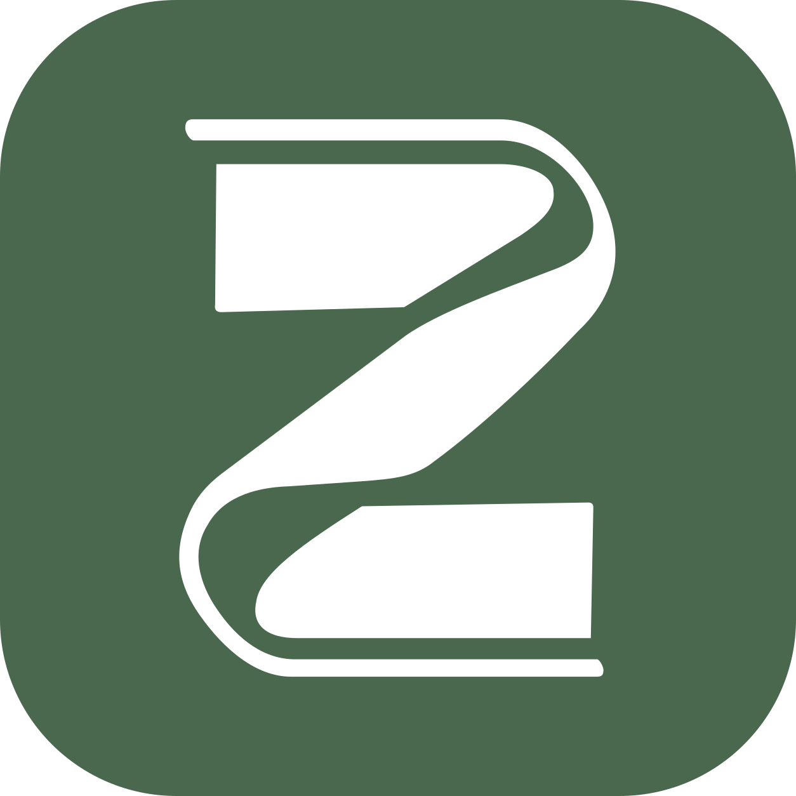

<div align="center">



# ZViewer

[**简体中文**](README.md) | [English](README.en.md)

[](https://github.com/Zo-Live/ZViewer/releases/latest) [](LICENSE) [](#安装与开始阅读) [](https://kotlinlang.org) [](https://developer.android.com/compose)

**一个原生 Android 本地漫画阅读器，支持常见压缩格式、PDF、图片与视频文件夹。**

</div>

## 安装与开始阅读

支持 Android 10 及以上，通用安装包适用于主流手机与模拟器。

1. 首次打开，点击「选择书库文件夹」，在系统文件选择器中进入漫画目录，点击「使用此文件夹」并授权。
2. 应用会扫描该目录，显示每本漫画的封面和名称；之后启动会直接显示这个书库。
3. 点击漫画开始阅读。轻点画面显示浮动进度条，再次轻点收起；拖动进度条或点击页码可以跳页。
4. 图片和视频均可用双指捏合、双击或进度面板缩放。视频默认自动播放；轻点画面显示工具栏及其上方的播放进度条，左侧按钮用于播放 / 暂停，上方显示「当前时间 / 视频全长」。拖动播放进度条以定位；再次轻点画面一并收起。
5. 在阅读设置中切换垂直连续、水平翻页及从右向左翻页。使用系统边缘返回手势或左上角返回按钮回到书库。

Android 通常不允许授权内部存储根目录、Download 根目录及 Android/data。请创建一个具体的漫画子文件夹，例如 `Download/comics`，再选择它。应用无需「所有文件访问」权限。

## 功能

| 类别     | 支持                                                                                             |
| -------- | ------------------------------------------------------------------------------------------------ |
| 漫画来源 | ZIP / CBZ、RAR / CBR、7Z、PDF、图片文件夹、视频文件夹                                            |
| 静态图片 | JPG、JPEG、PNG、WebP、BMP、HEIF、HEIC、AVIF                                                      |
| 动态图片 | APNG、Animated WebP、GIF、Animated AVIF                                                          |
| 视频     | MP4、M4V、MKV、WebM、AVI、MOV、3GP、MPG、MPEG、TS、MTS、M2TS、FLV、WMV、OGV 等                   |
| 书库     | 递归扫描、自然排序、高清封面、搜索、阅读状态筛选、最近阅读、收藏、2–5 列网格                    |
| 阅读     | 图片垂直连续 / 水平分页、视频垂直 / 水平逐个切换、缩放、页码跳转、逐视频进度、平滑图片循环、常亮 |
| 外观     | 跟随系统 / 浅色 / 深色主题、预设主题色、自定义主题色、独立亮暗阅读背景                           |
| 系统     | 沉浸式阅读、横竖屏、记住书库授权                                                                 |
| 存储     | 缓存清理与自动回收                                                                               |

阅读时缩放范围为适合屏幕至 5 倍，并可随时恢复适合屏幕。

## 格式支持与限制

- 压缩包中的文件按文件名自然排序，例如 `2.jpg` 排在 `10.jpg` 前。
- 图片文件夹中直接包含的图片组成一本书，子目录分别扫描。
- 仅包含视频的文件夹或压缩包组成一本书；图片和视频混合时会提示分开存放。视频压缩包首次打开会解压到应用临时目录。
- 视频默认按顺序自动播放下一段，每段视频会记住播放位置；设置可改为单个视频循环或仅预览后使用播放按钮开始播放。视频文件夹和压缩包以自然排序第一个视频的抽帧作为封面。
- 「循环模式」开启后，图片末页与首页在两个方向上连续衔接，可自然滑入相邻页；视频在首尾之间直接切换。「清除阅读记录」在设置中双击执行且不影响收藏。
- 7Z 固实压缩包首次打开需要先准备整本内容，较大的书会等待较久。
- 加密压缩包、分卷文件、密码 PDF 和 DRM 内容暂不支持，请先解密或解压为文件夹。
- HEIF / HEIC 能否显示取决于设备，且不支持动态 HEIF；APNG、GIF、动态 WebP 和动态 AVIF 均可正常播放。
- 文件过大、页数过多或内容损坏时会明确报错，不会卡死或占满存储。
- 阅读进度按页（视频按第几个视频）保存；应用被系统终止后重新打开，可继续上次阅读和视频位置。

## 隐私与数据

ZViewer 不申请联网权限，不包含账号或广告。阅读记录、封面与缓存都保存在设备本地，可在应用内清理；缓存达到约 1.5 GiB 时会自动回收。

## 本地构建

需要 JDK 17、Android SDK 36 与网络（仅构建时下载依赖）。工程自带 Gradle 8.11.1 Wrapper。

```sh
export JAVA_HOME=/usr/lib/jvm/java-17-openjdk-amd64
export ANDROID_HOME="$HOME/Android"
./gradlew :app:assembleDebug :app:testDebugUnitTest :app:lintDebug
```

SDK 路径不同时调整 `ANDROID_HOME`，或在未跟踪的 `local.properties` 中设置 `sdk.dir`。

## 发布构建与签名

密钥位于 `.signing/zviewer-release.jks`，别名为 `zviewer`；口令通过 `ZVIEWER_STORE_PASSWORD`、`ZVIEWER_KEY_PASSWORD` 传入。

```sh
./gradlew :app:assembleRelease
```

产物为 `app/build/outputs/apk/release/app-release.apk`。

当前正式版本为 `1.2.2`（`versionCode=7`），发布安装包为 `dist/ZViewer-1.2.2-release.apk`，SHA-256 校验文件为 `dist/ZViewer-1.2.2-release.apk.sha256`。

私钥与口令不得提交到 Git，`.signing/` 必须单独安全备份。后续发布必须使用同一密钥并递增 `versionCode`，已安装应用才能覆盖升级并保留数据；若在新机器上生成新密钥，则只能全新安装。

## 测试与实现文档

- [开发计划](docs/开发计划.md) · [架构与兼容性](docs/架构与兼容性.md) · [测试记录](docs/测试记录.md)
- 核心逻辑测试在 `app/src/test/`，设备格式集成测试在 `app/src/androidTest/`，样本由 `tools/generate_fixtures.py` 生成。

## 开源组件

基于 [AndroidX / Compose](https://github.com/androidx/androidx)、[Media3](https://github.com/androidx/media)、[Android 开源项目](https://android.googlesource.com/platform/frameworks/base/)、[Kotlin](https://github.com/JetBrains/kotlin)、[libarchive](https://github.com/libarchive/libarchive)、[APNG4Android](https://github.com/penfeizhou/APNG4Android) 与 [libavif](https://github.com/AOMediaCodec/libavif) 等开源组件构建。视频播放使用 Media3，手势识别和视频封面抽帧使用 Android 开源框架中的 GestureDetector / ScaleGestureDetector 与 MediaMetadataRetriever。

## 许可证

MIT
